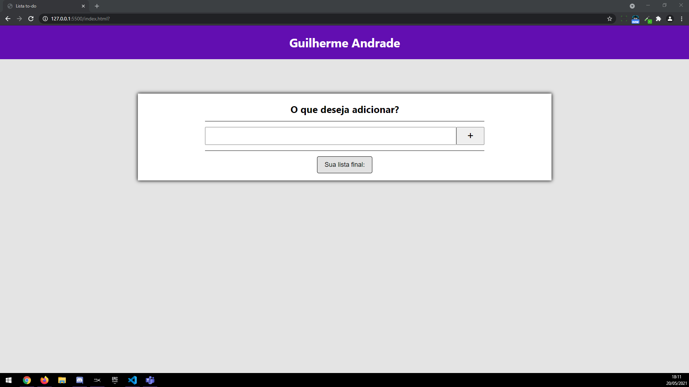
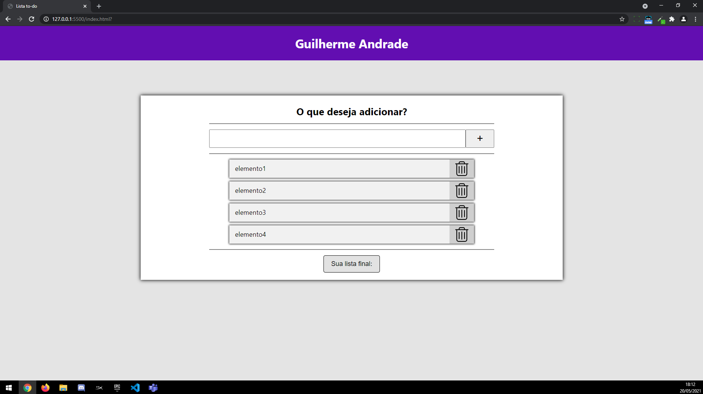
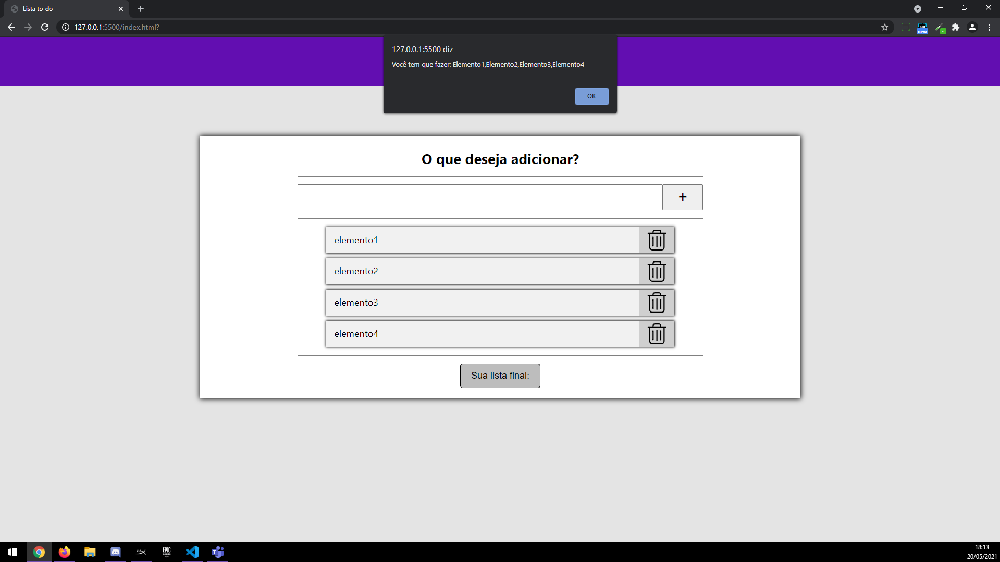

# Aplicação to/do

<h2>Tecnologias Utilizadas:</h2>
<ul>
    <li>HTML5</li>
    <li>CSS3</li>
    <li>Java Script</li>
</ul>

# A Aplicação

<h2>Objetivos</h2>

A criação de uma aplicação de "lista de afazeres" simples sem conexão back-end para o desenvolvimento de um projeto do ensino técnico desenvolvimento de sistemas!

<h2>A Aplicação</h2>

Tela inicial da aplicação!

Elementos Adicionados!

Lista Final!

<h2>Observação</h2>

A página atualiza os indices de cada array e box de resultado conforme adiciona e remove os elementos.
